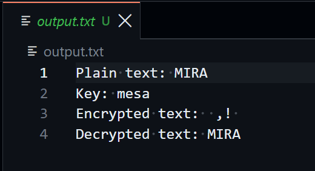
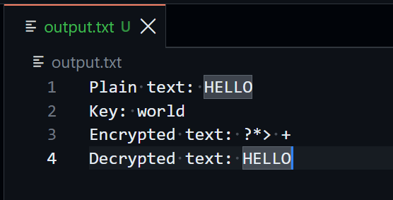
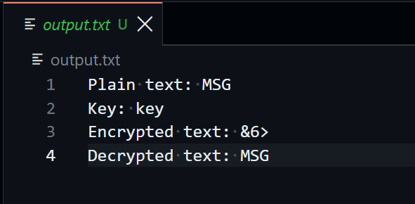

## Final Project

### Task 2: Encryption and Decryption
```asm
section .data 
	;enter msg and key
	;msg and key combinations
	;MIRA mesa
	;HELLO world
	;MSG key
	msg db 'MIRA'
	msg_len equ $ - msg
	key db 'mesa'
  ;`msg_len` is used as a counter for the loops to iterate for each character.
	
	;filename
	filename db 'output.txt', 0h
	
	;output to textfile
  ;line by line output. `line#_len` tells `sys_write` how many characters to write.
	line1 db 'Plain text: '
	line1_len equ $ - line1
	line2 db 'Key: '
	line2_len equ $ - line2
	line3 db 'Encrypted text: '
	line3_len equ $ - line3
	line4 db 'Decrypted text: '
	line4_len equ $ - line4

  ;newline character
	newline db 0xa
	
section .text
	global _start
	
_start:
  ;initialize ecx to 0. ECS value is the position for the current character being processed.
	mov ecx, 0
	
encrypt:
	;encrypt each character
	;al loads character from message
	;xor al onto the corresponding key character
	;ecx is in position of corresponding characters
	;store character to encrypted_msg
	mov al, [msg + ecx]
	xor al, [key + ecx]
	mov [encrypted_msg + ecx], al
	
	;ecx is incremented to encrypt next character
	;cmp ecx to msg_len
	inc ecx
	cmp ecx, msg_len
	
	;if less, then run loop again
	jl encrypt
	
	;if more, then reset ecx position to first character
	mov ecx, 0
	
decrypt:
	;decrypt each character
	;al loads current character
	;xor al against corresponding key character
	;reverses encryption
	;store decrypted character to decrypted_msg
	mov al, [encrypted_msg + ecx]
	xor al, [key + ecx]
	mov [decrypted_msg + ecx], al
	
	;increment ecx to decrypt next character, and retrieve next key character to xor
	;cmp ecx to msg_len
	inc ecx
	cmp ecx, msg_len
	
	;if less then loop again
	jl decrypt
	
	;if more then move onto printing output

output:
	;create file
	;EAX -> file_create sys call
	;EBX -> filename
	;ECX -> file permissions
	;[fd_out] -> stores eax to [fd_out] for later retrieval or file descriptor
	;it holds the id num of output.txt that is currently stored in EAX
	mov eax, 8
	mov ebx, filename
	mov ecx, 0777o
	int 0x80
	mov [fd_out], eax
	
	;EAX -> system call for sys-write
	;EBX -> file description
	;ECX -> data address to write
	;EDX -> bytes/characters to write
	
	;write line1
	mov eax, 4
	mov ebx, [fd_out]
	mov ecx, line1
	mov edx, line1_len
	int 0x80
	;write msg
	mov eax, 4
	mov ebx, [fd_out]
	mov ecx, msg
	mov edx, msg_len
	int 0x80
	
	;new line
	mov eax, 4
	mov ebx, [fd_out]
	mov ecx, newline
	mov edx, 1
	int 0x80
	
	;write line2
	mov eax, 4
	mov ebx, [fd_out]
	mov ecx, line2
	mov edx, line2_len
	int 0x80
	;write key
	mov eax, 4
	mov ebx, [fd_out]
	mov ecx, key
	mov edx, msg_len
	int 0x80
	
	;new line
	mov eax, 4
	mov ebx, [fd_out]
	mov ecx, newline
	mov edx, 1
	int 0x80
	
	;write line3
	mov eax, 4
	mov ebx, [fd_out]
	mov ecx, line3
	mov edx, line3_len
	int 0x80
	;write encrypted_msg
	mov eax, 4
	mov ebx, [fd_out]
	mov ecx, encrypted_msg
	mov edx, msg_len
	int 0x80
	
	;new line
	mov eax, 4
	mov ebx, [fd_out]
	mov ecx, newline
	mov edx, 1
	int 0x80
	
	;write line4
	mov eax, 4
	mov ebx, [fd_out]
	mov ecx, line4
	mov edx, line4_len
	int 0x80
	;write decrypted_msg
	mov eax, 4
	mov ebx, [fd_out]
	mov ecx, decrypted_msg
	mov edx, msg_len
	int 0x80

close_exit:
	;close file
	;EAX -> sys_close
	;EBX -> file description
	mov eax, 6
	mov ebx, [fd_out]
	int 0x80
	
	;exit
	mov eax, 1
	mov ebx, 0
	int 0x80

section .bss
	;reserves memory ahead of variable creation
	;based on msg_len
	;resd saves 4 bytes
	encrypted_msg resb msg_len
	decrypted_msg resb msg_len
	fd_out resd 1
	
```





## Challenges
There are some limitations to the program:
1. Not all encrypted characters are printable, sometimes it produces control characters. This limits available message and key combinations that encrypt withing the printable range for ASCII. The easiest way to guarantee printable characters is to have the message be uppercase and the key be lowercase.cle
2. Hardcoded message and key, must be entered manually to .data
3. Key and message must be same length or it will not be fully encrypted/decrypted due to msg_len being used for both. There is no control implemented for making sure that they are the same length.
