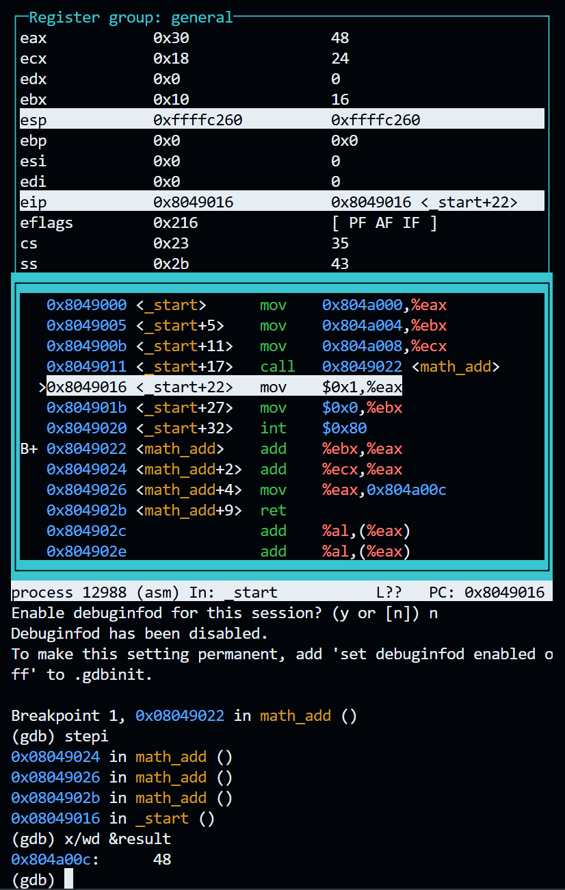

### Question 1
Assign integer values to the variables x, y, and z, and pass them to a function of your choice. The function should add the three variables, store the sum in the result variable, return the result to the calling program, and properly deallocate any memory used by the function before returning.
```
section .text
    global _start

_start:
	mov eax, [x]
	mov ebx, [y]
	mov ecx, [z]
    call math_add

    mov eax, 1
    mov ebx, 0
	int 0x80

math_add:
	add eax, ebx
	add eax, ecx
	mov [result], eax
	ret

section .data
    x dd 8
    y dd 16
    z dd 24

segment .bss
    result resd 1
	
```


