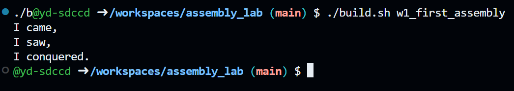

## Assignment Solution
### Sections
1. Flowchart
2. Challenges
3. Assembly Code
4. [Output](#Output)
5. Resources
# Flowchart
1. Initialize environment[^3]
2. Use Hello World example from the Introduction to Assembly Language lecture[^1] as structural basis for this assignment
3. Create file: nano w1_first_assembly.asm
	1. `section .text` -> Define section containing executable instructions
		1. `global _start` exports the `_start` label for the linker
	2. `_start` defines start of instructions
		1. `eax` -> System call number
			1. `mov eax, 4` -> Place 4 (`sys_write`) into `eax` register
		2. `ebx` -> File descriptor
			1. `mov ebx, 1` -> Place 1 (standard output) into `ebx` register
		3. `ecx` -> Address of data
	        1. `mov ecx, msg` -> Place memory address of `msg` into `ecx` register
	        2. `msg` points to first byte of message stored in `.data` section
	    4. `edx` -> Number of bytes
	        1. `mov edx, len` -> Place total message length into `edx` register
	        2. `len` determines number of bytes sent to standard output
	    5. `int 0x80` -> Call Linux kernel
	        1. Kernel reads register values to perform `sys_write`
	        2. Print message stored at `msg`
	3. Exit program
	    1. `eax` -> System call number
	        1. `mov eax, 1` -> Place 1 (`sys_exit`) into `eax` register
	    2. `ebx` -> Exit status
	        1. `mov ebx, 0` -> Place 0 (successful exit) into `ebx` register
	    3. `int 0x80` -> Call Linux kernel
	        1. Kernel reads register values to perform `sys_exit`
	        2. Terminate program
	4. `section .data` -> Define section containing initialized data
	5. Define message
	    1. `msg` -> Label containing memory address of first message byte
	    2. `db` -> Define byte
	        1. Store each character as an ASCII byte
	    3. `msg db 'I came,', 0x0A`
	        1. Store `I came,`
	        2. `0x0A` -> Add newline character
	    4. `db 'I saw,', 0x0A`
	        1. Store `I saw,` immediately after first line
	        2. `0x0A` -> Add newline character
	    5. `db 'I conquered.', 0x0A`
	        1. Store `I conquered.` immediately after second line
	        2. `0x0A` -> Add newline character
	6. Calculate message length
	    1. `len equ $ - msg`
	        1. `len` -> Constant containing total message length
	        2. `equ` -> Define constant
	        3. `$` -> Current memory offset after final message byte
	        4. `msg` -> Starting memory offset of message
	        5. `$ - msg` -> Calculate total number of bytes between start and end of message
	        6. Total message length equals 28 bytes
4. Make file executable
	1. `./build.sh [fileName]`[^2]
	2. This assembles your `.asm` program to `.o`.
	3. It then links `[fileName]` into an executable
5. Run program
	1. bash `./build.sh w1_first_assembly`
# Challenges
- Since this is my first time working with assembly, I really had to go line by line to understand what everything does. Without the example from the lecture that I could reference, this would've been a much longer process.
- Having issue building .o, no file found in directory
	- had to create and save file as .asm
- Having issue trying to move my work from my working codespace to the class repository for sharing:
	- I learned how to package my assignment, download, and then upload
# Assembly Code
```
section .text
	global _start
	
_start:
	mov eax, 4
	mov ebx, 1
	mov ecx, msg
	mov edx, len
	int 0x80
	
	mov eax, 1
	mov ebx, 0
	int 0x80
	
section .data 
	msg db 'I came,', 0x0A
		db 'I saw,', 0x0A
		db 'I conquered.', 0x0A
		
	len equ $ - msg
```
# Output
Text
```
I came,
I saw,
I conquered.
```

Screenshot

# Resources

[^1]: Step 3: Create a Simple Assembly Program, Danish Khan  https://d-khan.github.io/cisc-courses/assembly/resources/assembly/
[^2]: Creating and Using an Assembly Language Build Script, Danish Khan https://d-khan.github.io/cisc-courses/assembly/resources/assembly/
[^3]: https://sdccd-edu.zoom.us/rec/play/SUaTNT011sxV2ECXMbAXiRqBF7Ed7uHiHCjTwb26AHGGTIBI9eydp3ZFk3IG5mOfLnAeiNy7mcNkjs-I.OgWNY1tLTpTyuFtI?accessLevel=meeting&canPlayFromShare=true&from=share_recording_detail&startTime=1782335209000&oldStyle=true&componentName=rec-play&originRequestUrl=https%3A%2F%2Fsdccd-edu.zoom.us%2Frec%2Fshare%2FKqZ6uGy7H35HhW8no_KazoRuKSE7CbRe8-yWGvlJGc_1tB8CioIYEuGX6idIp-kX.jyxpzAzRfszsojBg%3FstartTime%3D1782335209000

Additional
1.  https://csapp.cs.cmu.edu/3e/docs/gdbnotes-x86-64.pdf
