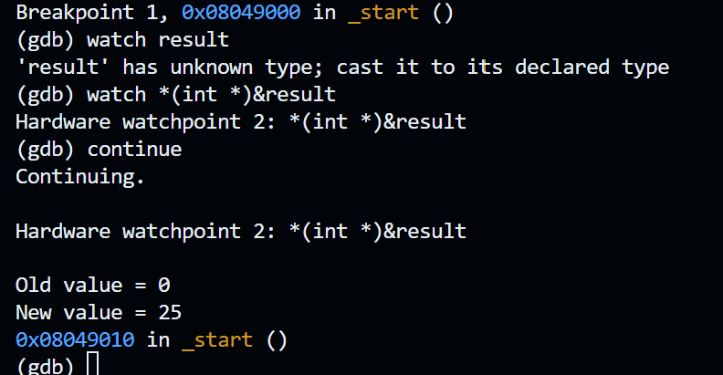

## Variables and Constants
### Assignment Solution
#### Sections
1. [Flowchart](#Flowchart)
2. [Code](#Code)
3. [Output](#Output)
4. [Challenges](#Challenges)
5. [Resources](#Resources)
# Flowchart
## Step 1: Create assembly file
`nano s2_a2.asm` and inserted starter code.
## Step 2: Meeting assignment requirements
Write an Assembly language program that uses initialized and uninitialized variables.
Requirements:
- Assign **10** to the variable **var1**.
- Assign **15** to the variable **var2**.
- Add **var1** and **var2** and store the result in the variable **result**.
### Implementation:
First I assigned the variables in the `.data` section. 
```
segment .data
	var1 dd 10
	var2 dd 15
```
`dd` is doubleword, or 4 bytes. We use doubleword because `eax` holds 32 bits.

Then I added the variables in the `_start` section.
```
_start
	mov eax, [var1]
	add eax, [var 2]
	mov [result]
```

Finally, I stored `result` in the `.bss` section.
```
segment .bss
	result resd 1
```
`resd` reserves 1 doubleword.
## Step 3: Build file
Build file, bash:
`./build.sh w2_a2`
## Step 4: Verify Result with GDB
Verify with GDB

Bash
```
gdb ./w2_a2
```

gdb
```
break _start
run
watch *(int *)&result
continue
```

Breakdown of `watch *(int *)&result`
- `watch` -> create watchpoint. Watchpoints stop execution when a value changes.
- `*(int *)` -> treats address as pointer to 32-bit integer.
- `&result` -> gets memory address of `result`
# Code
Using starter code provided by the assignment page.
```
section .text
        global _start

_start:
        ; use this space for the main body of your program
        ; ======== write your code below ===========

		mov eax, [var1] ; load var1 into eax
		add eax, [var2] ; add var2 into eax
		mov [result], eax ; store result into result

        ; ======== write your code above ===========

        mov eax,1      ; set eax register to 1 (do not remove this line)
        int 0x80       ; interrupt 0x80 (do not remove this line)

segment .bss
        ; use this space for uninitialized variable (result)
        
        result resd 1 ; reservs one 32-bit value

segment .data
        ; use this space for initialized variables (var1 and var2)
        
        var1 dd 10 ; initialized to 10
        var2 dd 15 ; initialized o 15
        
```
# Output
Verify with GDB
Bash
```
gdb ./w2_a2
```
gdb
```
break _start
run
watch *(int *) result
continue
```

Text
```
Continuing.

Hardware watchpoint 2: *(int *)&result

Old value = 0
New value = 25
0x08049010 in _start ()
```

Screenshot

# Challenges
- why mov and add?
	- Mov copies a value from one place to another. `var1` is copied into `eax`.
	- Add adds var2 to eax.
	- So `mov eax, [var1]` moves `var1` to eax. Then `add eax, [var 2]` adds `var2` to `var1`. Finally, `mov [result]` copies `eax` to `[result]`. 

- resd 1
	- `.bss` is for variables that need storage but are not initialized
	- `resd 1` reserves one doubleword
	- How do we know how many bytes we want to reserve
		- eax is 32-bit register, result is also 4 bytes.

- What variable do we use?
	- `dd` is doubleword, or 4 bytes. We use doubleword because `eax` holds 32 bits.

- Using gdb
	- GDB Notes, https://csapp.cs.cmu.edu/3e/docs/gdbnotes-x86-64.pdf
- error: result has unknown type, cast to it declared type
- watch *(int *)&result
	- `watch` -> create watchpoint. Watchpoints stop execution when a value changes.
	- `*(int *)` -> treats address as pointer to 32-bit integer.
	- `&result` -> gets memory address of `result`
# Resources
1. Assembly Language Resources, Danish Khan https://d-khan.github.io/cisc-courses/assembly/resources/assembly/
2.  GDB Notes, https://csapp.cs.cmu.edu/3e/docs/gdbnotes-x86-64.pdf
