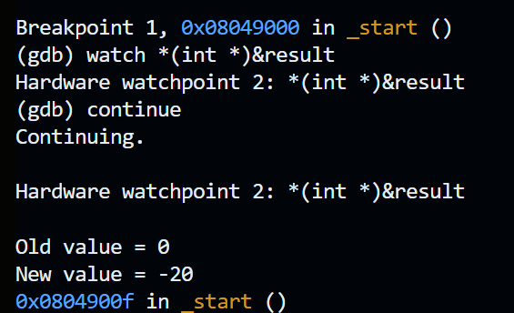
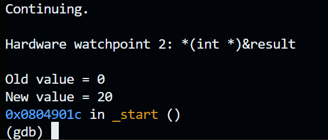
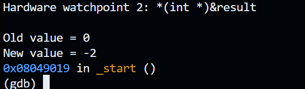
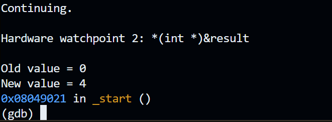

## Arithmetic Instructions
### Assignment Solution
#### Sections
1. [Flowchart](#Flowchart)
2. [Code](#Code)
3. [Output](#Output)
4. [Challenges](#Challenges)
5. [Resources](#Resources)
### Objective
Learn how to perform arithmetic instructions in Assembly language.

The variables on the right-hand side of the equations are initialized variables. The variable on the left-hand side is uninitialized. Perform the following arithmetic instructions.
**Use a separate file for each equation.**
1. `result = -var1 * 10`
2. `result = var1 + var2 + var3 + var4`
3. `result = (-var1 * var2) + var3`
4. `result = (var1 * 2) / (var2 - 3)`, choose `var1` and `var2` so that the result is an integer.
### Debugging Parameters
I recommend using the following debugging parameters to display the results. See the lecture materials for the explanation.
```
layout asm
layout regs
watch (int) result
break _start
run
stepi
```

---
# Flowchart

### Make base file
To save time, I decided to make a base file that I can just copy for the assignment files. Having completed the previous variables and constants assignment, helped clear up a lot of questions I would've had. This way, I can mostly focus on the arithmetic in the `_start` sections.
```
section .text
	global _start
	
_start:
	
	
	mov ebx, 0
	mov eax, 1
	int 0x80
	
sections .bss
	result resd 1

section .data
	var1 dd 2
	var2 dd 4
	var3 dd 6
	var4 dd 8
```
### Equation 1
1. `result = -var1 * 10`
Load the value of `var1` into `eax`. `eax` will equal `2`.
```
mov eax, [var1]
```

Change `eax` sign to negative
```
neg eax
```

Multiply (signed) `eax` and `10`. Result is stored in eax.
```
imul eax, 10
```

Copy `eax` to `result`
```
mov [result], eax
```
### Equation 2
2. `result = var1 + var2 + var3 + var4`
Equation two is the simplest, we just add all four variables to `eax` and then save the result to `result`.

Move the first variable into `eax`.
```
mov eax, [var1]
```

To add a variable to `eax`
```
add eax, [var2]
```

Store sum in `result`
```
mov [result], eax
```
### Equation 3
3. `result = (-var1 * var2) + var3`
Move the first variable into `eax`.
```
mov eax, [var1]
```

Change `eax` sign to negative
```
neg eax
```

Multiply (signed) `eax` and `var2`. Result is stored in eax.
```
imul eax, [var2]
```

Add `var3` and `eax`.
```
add eax, [var3]
```

Store `eax` in `result`
```
mov [result], eax
```
### Equation 4
4. `result = (var1 * 2) / (var2 - 3)`, choose `var1` and `var2` so that the result is an integer.
Move the first variable into `eax`.
```
mov eax, [var1]
```

Load 2 into `ecx`, so that we can use the mul operand
```
mov ecx, 2
```

Multiply `ecx` and `ebx`. The product is then stored in `edx:eax`.
```
mul eax, 2
```

Move `var2` to `ebx`, so that we can subtract 3 from it.
```
mov ebx, [var2]
```

Subtract 3 from `var2`
```
sub ebx, 3
```

Clear `edx` so that `edx:eas` only contains `eax`.
```
mov edx, 0
```

Divide `edx:eax` by `ebx`, leaving the quotient in `eax`.
```
div ebx
```

Store `eax` in `result`
```
mov [result], eax
```

### Verify outputs with gdb
Build `./build.sh [filename]`
Open `gdb ./[filename]`
```
break _start
run
watch *(int *)&result
continue
```

Jump to [Output](#Output)
# Code
### Equation 1
```
section .text
	global _start
	
_start:
	
	mov eax, [var1]
	neg eax
	imul eax, 10
	mov [result], eax
	
	mov ebx, 0
	mov eax, 1
	int 0x80
	
section .bss
	result resd 1

section .data
	var1 dd 2
	var2 dd 4
	var3 dd 6
	var4 dd 8
```
### Equation 2
```
section .text
	global _start
	
_start:
	
	mov eax, [var1]
	add eax, [var2]
	add eax, [var3]
	add eax, [var4]
	mov [result], eax
	
	mov ebx, 0
	mov eax, 1
	int 0x80
	
section .bss
	result resd 1

section .data
	var1 dd 2
	var2 dd 4
	var3 dd 6
	var4 dd 8
```
### Equation 3
```
section .text
	global _start
	
_start:
	
	mov eax, [var1]
	neg eax
	imul eax, [var2]
	add eax, [var3]
	mov [result], eax
	
	mov ebx, 0
	mov eax, 1
	int 0x80
	
section .bss
	result resd 1

section .data
	var1 dd 2
	var2 dd 4
	var3 dd 6
	var4 dd 8
```
### Equation 4
`result = (var1 * 2) / (var2 - 3)`
```
section .text
	global _start
	
_start:
	
	mov eax, [var1]
	mov ecx, 2
	mul ecx
	
	mov ebx, [var2]
	sub ebx, 3
	
	mov edx, 0
	div ebx
	
	mov [result], eax
	
	mov ebx, 0
	mov eax, 1
	int 0x80
	
section .bss
	result resd 1

section .data
	var1 dd 2
	var2 dd 4
	var3 dd 6
	var4 dd 8
```
# Output
### Equation 1
Text
```
Old value = 0
New value = -20
```

Screenshot

### Equation 2
Text
```
Old value = 0
New value = 20
```

Screenshot

### Equation 3
Text
```
Old value = 0
New value = -2
```

Screenshot

### Equation 4
Text
```
Old value = 0
New value = 4
```

Screenshot


# Challenges
- mul vs imul
	- imul takes into account the sign.
# Resources
Additional
1.  Arithmetic Instructions, Danish Khan https://d-khan.github.io/cisc-courses/assembly/lectures/arithmetic_instructions/
2. 
