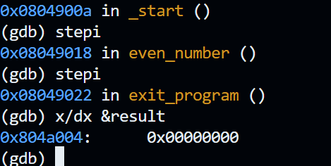
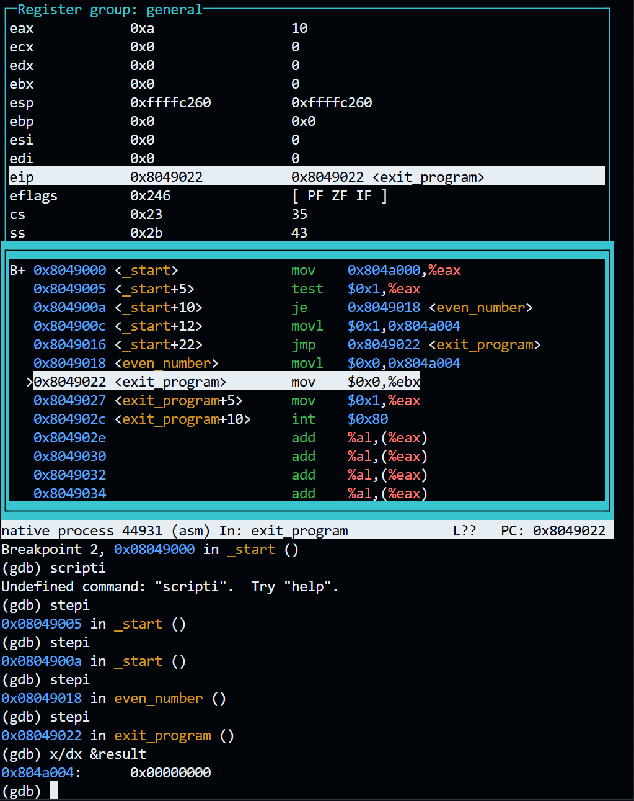

## Logical Instructions
### Assignment Solution
#### Sections
1. [Flowchart](#Flowchart)
2. [Code](#Code)
3. [Output](#Output)
4. [Challenges](#Challenges)
5. [Resources](#Resources)
### Task
Perform the following logical operations using Assembly language.
1. Demonstrate that **XORing** an operand with itself changes the operand to **0**.
2. Create a practical example where a **TEST** instruction can be used. Explain the purpose of the instruction and demonstrate its use in your code.
### Debugging Parameters
I recommend using the following debugging parameters to display the results. See the lecture materials for additional explanations.
```
layout asm
layout regs
watch (int) result
break _start
run
stepi
```

---
# Flowchart
### Step 1: Create assembly files
Created two assembly files.
Bash
```
nano w3_a2_xor.asm
nano w3_a2_test.asm
```
The first file demonstrates the `XOR` instruction.
The second file demonstrates the `TEST` instruction.
### Step 2: XOR an operand with itself
Write an Assembly language program that uses `XOR` on the same operand.
Requirement:
- Assign a positive value to `var1`.
- Move `var1` into `eax`.
- XOR `eax` with itself.
- Store the result in `result`.
#### Implementation:
First I assigned `var1` in the `.data` section.
```
section .data
	var1 dd 10
```

Then I moved `var1` into `eax`.
```
mov eax, [var1]
```

Then I XORed `eax` with itself.
```
xor eax, eax
```
XORing a value with itself changes every bit to `0`.

Finally, I stored `eax` in `result`.
```
mov [result], eax
```
The final result should be `0`.
### Step 3: Create a TEST example
Write an Assembly language program that uses `TEST`.
The program checks whether a number is even or odd.
Requirement:
- Assign a positive value to `var1`.
- Move `var1` into `eax`.
- Test the last bit of `eax`.
- Store `0` if the number is even.
- Store `1` if the number is odd.
#### Implementation:
First I assigned `var1` in the `.data` section.
```
section .data
	var1 dd 10
```

Then I moved `var1` into `eax`.
```
mov eax, [var1]
```

Then I tested the last bit.
```
test eax, 1
```

`TEST` compares bits without changing the value in `eax`.
If the last bit is `0`, the number is even.
If the last bit is `1`, the number is odd.

Then I used `jz` to jump when the result of `TEST` is zero.
```
jz even_number
```

If the number is odd, store `1`.
```
mov dword [result], 1
```

If the number is even, store `0`.
```
even_number:
	mov dword [result], 0
```
### Step 4: Store result
The `.bss` section stores the result.
```
section .bss
	result resd 1
```
`resd 1` reserves one 32-bit doubleword.
### Step 5: Build files
Build the XOR file.
Bash
```
./build.sh xor_self
```

Build the TEST file.
Bash
```
./build.sh test_example
```
### Step 6: Verify results with GDB
Verify XOR result.
```bash
gdb ./xor_self
```

```gdb
layout asm
layout regs
watch *(int *)&result
break _start
run
stepi
```

Until result is reached:
```asm
mov [result], eax
```

To check `result`:
```gdb
x/dw &result
```

The expected result is:
```text
0
```

Verify the TEST result.
```bash
gdb ./w3_a2_test
```

```gdb
layout asm
layout regs
watch *(int *)&result
break _start
run
stepi
```

Then check `result`
```gdb
x/dw &result
```

When `var1` is `10`, the expected result is:
```text
0
```
This means the number is even.

When `var1` is `11`, the expected result is:
```text
1
```
This means the number is odd.
# Code
### XOR demonstration
```
section .text  
	global _start  
  
_start:  
  
	mov eax, [var1]
	xor eax, eax
	mov [result], eax  
	  
	mov ebx, 0  
	mov eax, 1  
	int 0x80  
  
section .bss  
	result resd 1  
  
section .data  
	var1 dd 10
```
### Test Instruction
```
section .text  
	global _start  
  
_start:  
  
	mov eax, [var1] 
	test eax, 1
	jz even_number
	  
	mov dword [result], 1
	jmp exit_program  
  
even_number:  
	mov dword [result], 0
  
exit_program:  
	mov ebx, 0  
	mov eax, 1  
	int 0x80  
  
section .bss  
	result resd 1  
  
section .data  
	var1 dd 10
```
# Output
Text
```

```

Screenshot


Text
```

```

Screenshot

# Challenges
- XOR self equals 0
	- XOR means 1 if one and only one value are equal to one

- last bit even or odd
	- `TEST eax, 1` checks last bit
	- even = 0
	- odd = 1

- jz?
	- jz jumps for zero
	- clears when operation doesn't return zero

- find `mov [result], eax`
- how to see result
	- stepi again
	- `x/dw &result`
- When to stop step to find result
	- 1 or 0 stored in result
	- $0x0 or $0x1
	- step to execute and then inspect
	- it's 1 for 1 with the input code
	- stepi to mov1 $0x0, 0x80 (result)
# Resources
Additional
1.  Logical Instructions, Danish Khan https://d-khan.github.io/cisc-courses/assembly/lectures/logical_instructions/
