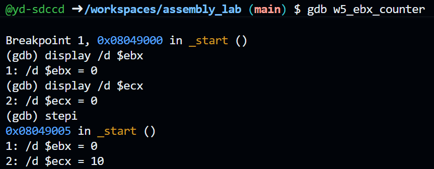
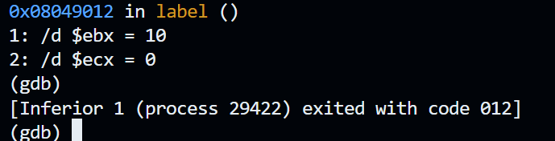
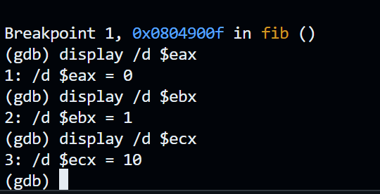
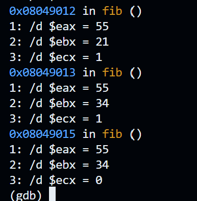
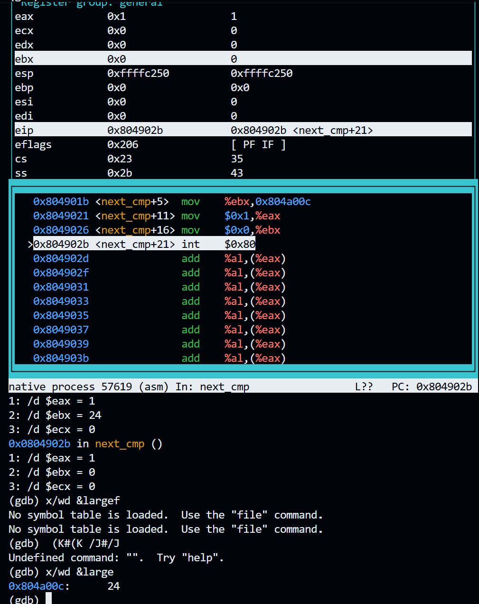

## Loops and Arrays
### Assignment Solution

Perform the following tasks:
1. Generate a counter using the `EBX` register, debug the code, and explain your findings. Use the _Counter (Optimized Version)_ from the lecture notes. (**2 points**)
2. Calculate the final number of the first 10 Fibonacci numbers starting from 0. The result should be equal to **55**. (**2 points**)
3. Define an integer array of length 3 and determine the largest element in the array. Use `gdb` to debug the code and verify that it works correctly and meets the requirements. (**6 points**)

---
## Task 1: EBX counter
Using counter (optimized version) from the Loops and Arrays lecture notes. We're incorporating EBX as the counter that counts to to 10 from 0. ECX is set as the loop counter, starting at 10.

```
section .text
    global _start

_start:
    mov ecx,10  ;ecx is a counter register
    mov ebx, 0 ; ebx as counter
        
    label:
    inc ebx
    loop label

    mov eax,1
    int 0x80
```
The program output displays the counter ECX counting down from 10 as it loops through the program. EBX is used as a counter to count up from 0 to 10. Program exits with code 012, which is the octal decimal for 10.


## Task 2: Fibonacci sum
Used a loop that used EAX and EBX as the F_1 and F_2 numbers to be added. EAX was pushed and pop into EBX so that EBX was always the 'old' value. ECX was set t0 10 to find the 10th Fibonacci sum.
```
section .text
	global _start
	
_start:
	mov eax, 0 ; seeded num1
	mov ebx, 1 ; seeded num2
	mov ecx, 10 ; counter

fib:
	push eax
	add eax, ebx
	pop ebx
	loop fib
	
	mov eax, 1
	mov ebx, 0
	int 0x80

```
Output shows EAX as 55.


## Task 3: Largest Array Element
Define an integer array of length 3 and determine the largest element in the array.

Created array with values 8, 16, 24. This program is similar to past cmp assignments in that moves through multiple sections and updates the largest value that is always set in EBX.
```
section .text
	global _start
	
_start:
	mov eax, array
	mov ebx, [array]
	mov ecx, 3
	
check:
	cmp ebx, [eax]
	jge next_cmp
	mov ebx, [eax]
	
next_cmp:
	add eax, 4
	loop check
	mov [large], ebx
	
	mov eax, 1
	mov ebx, 0
	int 0x80
	
section .data
	array dd 8, 16, 24
	
segment .bss
	large resd 1
```
Output shows large as 24.

# Challenges

# Resources
Additional
1. 
