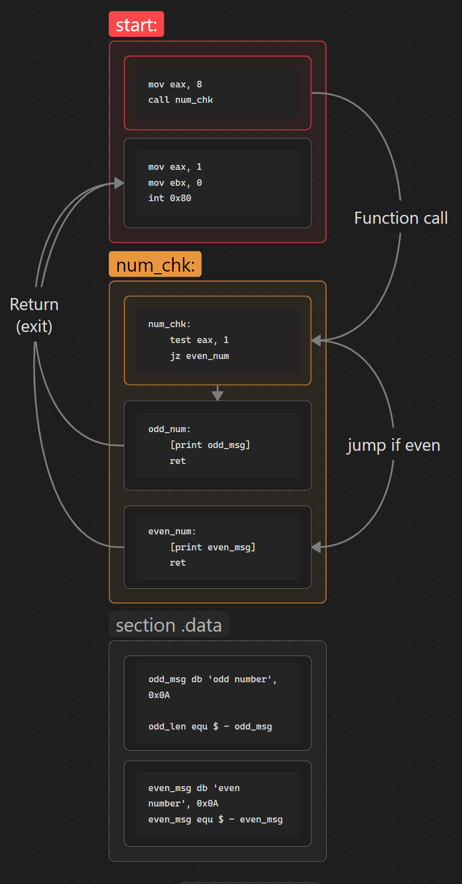
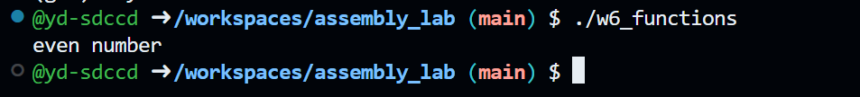

## Functions
### Assignment Solution
#### Sections
1. [Flowchart](##Flowchart)
2. [Code and Output](##Code)
3. [Challenges](#Challenges)
4. [Resources](#Resources)

Perform the following task:
1. Assign a number to a register or a variable and pass the value to a function. The function should determine whether the number is **odd** or **even**. Display the result on the console.
## Flowchart



## Code
Using question #3 from the midterm exam as a base for number check and printing message to console.
```asm
section .text
    global _start

_start:
    mov eax, 8
    call num_chk

    mov eax, 1
    mov ebx, 0
    int 0x80

num_chk:
    test eax, 1
    jz even_num

odd_num:
    mov eax, 4
    mov ebx, 1
    mov ecx, odd_msg
    mov edx, odd_len
    int 0x80
    ret

even_num:
    mov eax, 4
    mov ebx, 1
    mov ecx, even_msg
    mov edx, even_len
    int 0x80
    ret

section .data
    odd_msg db 'odd number', 0x0A
    odd_len equ $ - odd_msg

    even_msg db 'even number', 0x0A
    even_len equ $ - even_msg
```



## Challenges

## Resources
Additional
1.  Functions in Assembly Language, Danish Khan https://d-khan.github.io/cisc-courses/assembly/lectures/functions/
2. 
