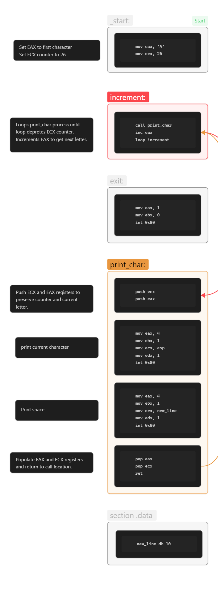
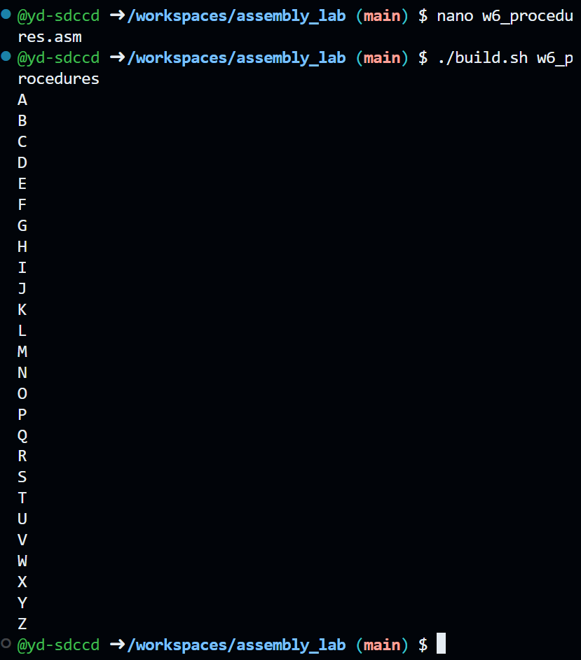

## Procedures
### Assignment Solution
#### Sections
1. [Flowchart](##Flowchart)
2. [Code and Output](##Code)
3. [Challenges](#Challenges)
4. [Resources](#Resources)

Perform the following task:
1. Generate English uppercase characters from **A** to **Z**. After every character, there must be a line feed. Use procedures and loops to optimize the code. **Do not use the `gdb` debugger.** The executable file should run directly in the terminal.

**Expected output format:**

```
A
B
C
D
E
...
Z
```
## Flowchart




## Code
```asm
section .text
	global _start
	
_start:
	mov eax, 'A'
	mov ecx, 26
	
increment:
	call print_char
	inc eax
	loop increment

exit:
	mov eax, 1
	mov ebx, 0
	int 0x80
	
print_char:
	push ecx
	push eax
	
	mov eax, 4
	mov ebx, 1
	mov ecx, esp
	mov edx, 1
	int 0x80
	
	mov eax, 4
	mov ebx, 1
	mov ecx, new_line
	mov edx, 1
	int 0x80
	
	pop eax
	pop ecx
	ret
	
section .data 
	new_line db 10
	
```


## Challenges
- Note the order that ECX and EAX are `push` and `pop` from the stack. Last-in-First-out order of retrieval.
- Had to move `exit:` under the `increment:` section because the program will continue onto `exit:` when loop finishes the EAX counter.
- Have to `push` and `pop` ECX and EAX because those registers are needed for printing.
## Resources
Additional
1. Procedures, Danish Khan  https://d-khan.github.io/cisc-courses/assembly/lectures/procedures/
